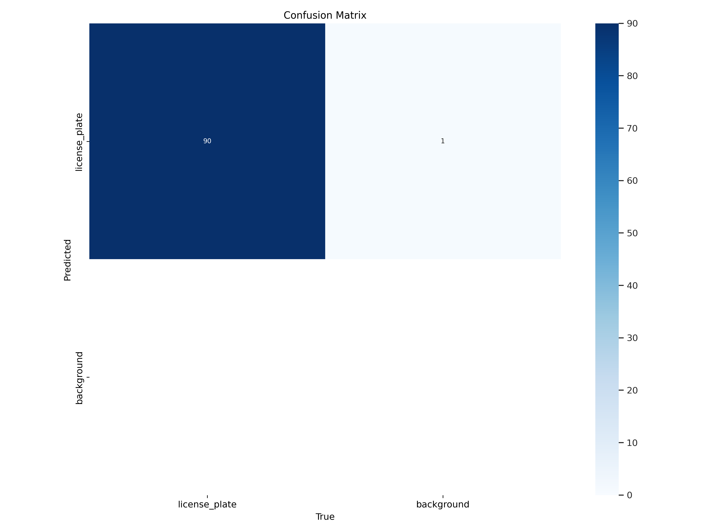

# car-license-detection
This project is focused on detecting car license plates using a trained YOLO model and OCR (Optical Character Recognition). The repository includes test images, annotations, model weights, evaluation metrics, and scripts to replicate the results.

Project Structure
graphql
Copy code
├── F1_curve.png          # F1 score curve for model evaluation
├── Lic_detection.ipynb   # Main Jupyter Notebook for running detection
├── PR_curve.png          # Precision-Recall curve
├── README.md             # Project documentation
├── R_curve.png           # Recall curve for model evaluation
├── annotated_919.jpg     # Example annotated test image
├── annotated_921.jpg     # Example annotated test image
├── annotated_929.jpg     # Example annotated test image
├── args.yaml             # Configuration file for model parameters
├── best.pt               # Trained YOLO model weights (best model)
├── confusion_matrix.png  # Confusion matrix visualization
├── last.pt               # Trained YOLO model weights (last checkpoint)
Description
The goal of this project is to detect car license plates from images using a deep learning model trained on YOLO. OCR is used for extracting the textual information from the detected license plates.

Key Features:
Trained using a custom dataset of car license plates.
Evaluated on 900 test images and 201 annotated images.
Includes evaluation metrics like F1 score, Precision-Recall curves, and confusion matrix.
Requirements
Python 3.8+
PyTorch
OpenCV
TensorFlow/Keras 
Load the model weights:

Use best.pt for the best-performing model.
Use last.pt for the last training checkpoint.
Execute the cells to run detection on test images.

Results
Evaluation Metrics:

Precision-Recall and F1 score curves available as PR_curve.png, F1_curve.png, and R_curve.png.
Confusion matrix visualization (confusion_matrix.png).
Annotated Test Images:

Example annotated results: annotated_919.jpg, annotated_921.jpg, annotated_929.jpg.
Future Work
Improve OCR accuracy for low-resolution images.
Fine-tune the YOLO model on additional datasets for better generalization.
Add a web-based interface for real-time license plate detection.
Acknowledgments
YOLO model implementation and training.
OCR tools for text extraction.

confusion_matrix

annotated_919,21,29

